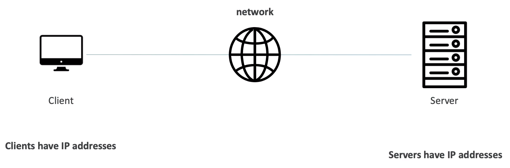
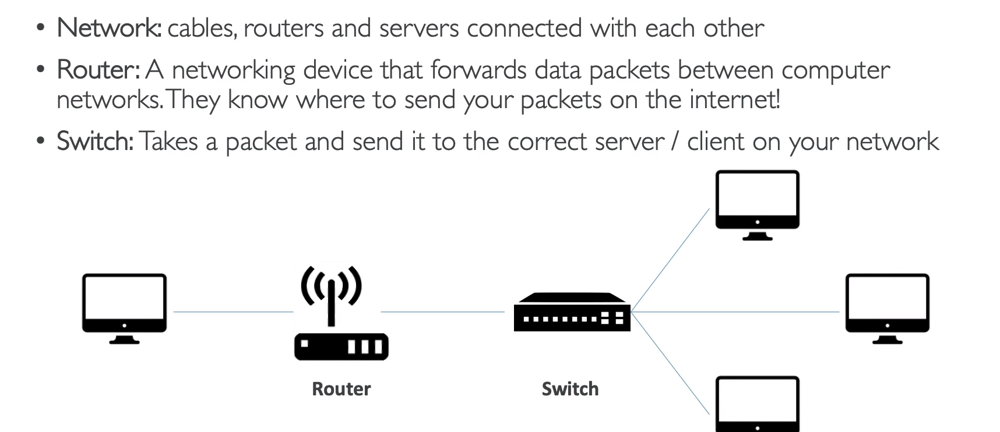
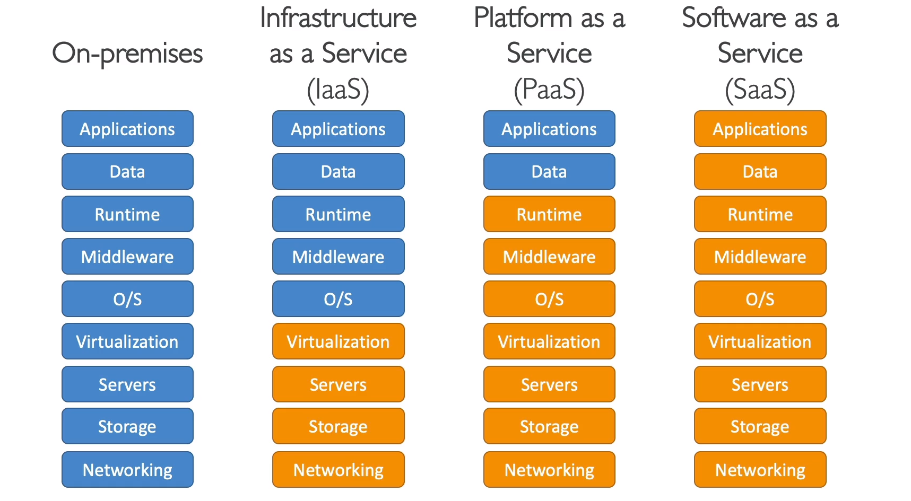
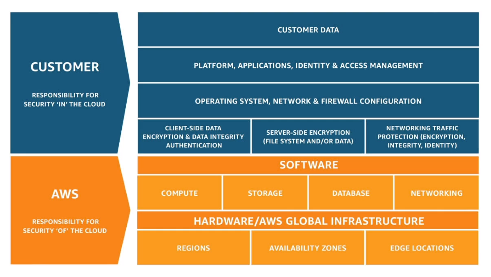

# Section 3 - What is Cloud Computing?
## How websites works?

Client and Server have unique IP address to locate them on the internet through which they can send request and get response

## What is a server composed of?
- Compute: CPU - It performs calculations and compute things
- Memory: RAM - Stores data that CPU computes (short term/temporary memory)
- Storage Data- To store long term, large files
- Database - Stores data in a structured way. Also helps to perform queries
- Network - Routers, Switch, DNS Server

## IT Terminology

**Internet Service Provider(ISP)** - Provides internet through phone, cable, fiber or satellite
**Modem** - Process the signal from ISP/ Performs modulation & demodulation of the signals
**Router**: 
- Will create our own local network
- Helps us to connect devices with local IP address(like houses in apartment share same address only the door number changes)
- Make sure that the web traffic get to appropriate device in our home

**Wireless Access Point(AP)** - Helps to communicate with devices over the air; Used in airports,hotels
**Switch** - What if we need some more additional ports than router, we can use switch which connects to router in one end and multiple devices in another end; Switch is just a bridge with a lot of outputs	

***Note**: Modern router consist of a combination of router, switch, modem and wireless access point(AP)*

* * *
## What is Cloud Computing
- **on demand delivery** of compute, memory, database and other IT resources
- **pay as you go** pricing
- Choose the right type and size of resources
- Access all the resources **instantly**

Types of Cloud - https://aws.amazon.com/types-of-cloud-computing/

## Deployment model of the Cloud
**1. Private Cloud(on premises):** Set up and managed by single organization; They have the complete control and satisfies their business needs
**2. Public Cloud:** Provided by third party service providers delivered over internet; AWS, Azure, Google Cloud
**3. Hybrid Cloud:** Some servers will be on prem and others will be on the cloud
***Note:** There is fouth type called multi cloud now - Uses multiple IaaS in their architecture*

## Five characteristics of Cloud Computing
1. On demand self service
2. Broad network service
3. Multi-tenancy and resource pooling
4. Rapid elasticity and scalability
5. Measured Services

## Six advantages of Cloud Computing
1. Trade CAPEX & OPEX
2. Massive economics of scale
3. Stop guessing capacity
4. Increase speed and agility
5. Don't have to run and maintain data centers
6. Go global in minutes

## Problems solved by the Cloud
Flexibilty, Scalability, Elasticity, Cost effective, High availabilty and fault tolerance, Agility
* * *
## Types of Cloud Computing
**- Iaas:** Provides building blocks IT such as networking, computation, storage, databases etc.. in its raw form. It is highly flexible. Eg - AWS, Azure, Google Cloud
**- Paas:** It helps to manage the underlying infrastructure on its own where we can only focus on deployment and management of the application - Heroku, AWS Beanstalk
**- Saas:** Product run and manged entirely by the service provider - Gmail, Slack, Google sheets, slides

## AWS  - 3 Pricing Fundamentals
1. Compute
2. Storage
3. Network - We only pay for **data out** of the cloud; data in is free

## AWS Global Infrastructure
- AWS Regions - clusters of data centers - US East, West, Asia Pacific
- AWS Zones - Each Region has many multiple zones - range(2 to 6); Separate from each other to protect data from disasters but they are connected by high bandwidth network; composed of one or more discrete data centers with redundant power, networking, and connectivity, and are used to deploy infrastructure
- AWS Data Centers
- AWS Edge Locations/ Points of Presence - The POPs are used for AWS CloudFront to deliver content to end users at high speeds/lower latency

### How to choose a AWS Region - It depends!
- [ ]  Compliance with data goverance and legal requirements
- [ ]  Customer - Reduced latency(distance)
- [ ]  Availablity - Not all regions have all the service
- [ ]  Pricing - varies from region to region

**Global Services**  - avaiable everywhere - IAM, Route 53, CloudFront
**Regional service** - services are region scoped - EC2, Elastic Beanstalk, Lambda
* * *
AWS Regional Services - To Check
https://aws.amazon.com/about-aws/global-infrastructure/?hp=tile&tile=map
* * *
## Share Responsibility Model
#### defines the distribution of responsibilities for security in the AWS Cloud
**Customer** = Responsibility for security **in** the cloud
**AWS** = Responsibility for security **of** the cloud

***Note**: If we are using a service we should know what is our responsibility as a customer and AWS's responsibilty*
* * *

