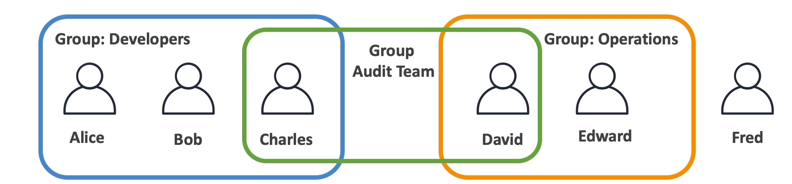
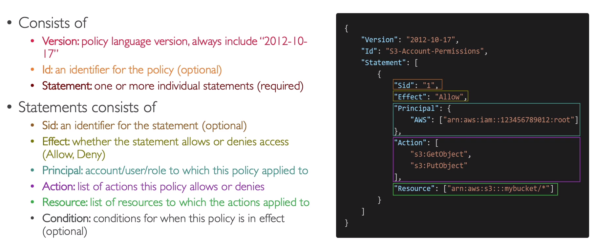
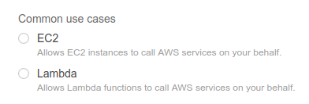
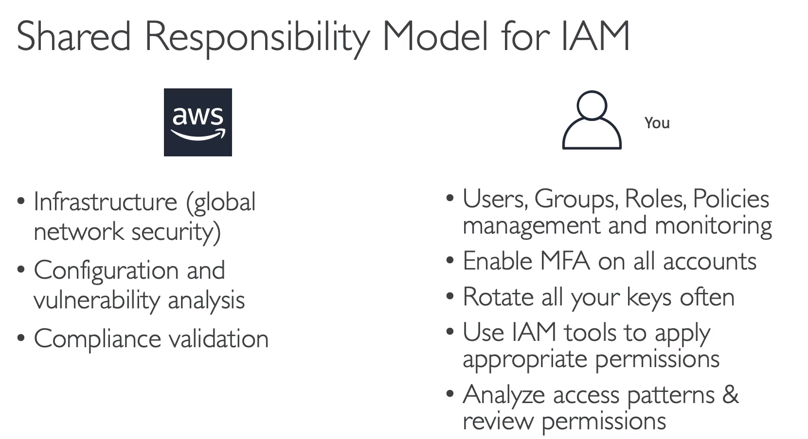

# Section 4 - Identity and Access Management
- Global Service
- We create users and assign them to groups
- We should not share our **Root account**

**1. Users:** People in an organization; They can be grouped; A user can be in single or multiple groups
**2. Groups:** User groups - Developer, Operations, Architect, etc; Groups cannot have other groups
**3. Policies:** To allow people to use our AWS account we create users and groups & set permisisions for them. (JSON documents) - **Define permissions** - **Use Least privilage priniciple**

***Note:** Users can be separate without being a group in AWS; It is not a best practice though*
* * *
Root user account is dangerous to use create an administrative account instead
### Policies
There are inline policies which can be applied to a single user
Users can be in multiple groups which makes them to inherit policies from both of the groups

#### IAM Policy Structure

#### To define a policy these 3 are important - Define the following
- Service - ex:IAM
- Actions - ex: listgroup,listuser
- Resources

### IAM Password Policy - We can set IAM user password policy
### MFA - Multi Factor Authentication - Use password as well as accept request from a device
Virtual MFA device - Google Authenticator, Authy, Microsoft Authenticator
Universal 2nd factor Security Key - Yubikey
#### I used Authy because it is a cross platform authenticator which can sync with multiple devices and operating systems - Which I personally feel the best up to now.

### Accessing AWS - 3 ways
1. AWS Console
2. CLI - through protected access keys
3. AWS SDK - language specific which we embed within our application(eg. AWS python SDK - Boto)

For linux: Use **sudo apt  install awscli**
aws configure --> Enter the access key id and secret access key
ex: aws iam list-users
* * *
### AWS CloudShell
We can also use AWS cloudshell to run aws cli commands which is avaiable only in specific regions
- We can upload & download files from specific path
- Change font size and theme

### IAM Roles
Sometimes, AWS Services(Say EC2 Instance) need to perform certain actions on AWS so to allow access it it we create IAM role and assign some permissions to AWS service(eg: EC2 instance)
Eg: EC2 instance role, lambda function role(what if ec2 instance need to call a lambda function)

### IAM Security Tools
1. IAM Credential Report(account-level): list all account users and status of their various credentials
2. IAM Access Advisor(user-level): Permissions granted to each user & their last accessed date. By reviewing this, we can change a user's permission when not used by him/her(priniciple of least privilage)

### lAM Guidelines & Best Practices `(Very Important)`
• Don't use the root account except for AWS account setup
• One physical user = One AWS user
• Assign users to groups and assign permissions to groups
• Create a strong password policy
• Use and enforce the use of Multi Factor Authentication (MFA)
• Create and use Roles for giving permissions to AWS services
• Use Access Keys for Programmatic Access (CLI / SDK)
• Audit permissions of your account with the AM Credentials Report
• Never share IAM users & Access Keys

### Shared Responsibility model of IAM
What are the things AWS is responsible?
What are the things that you are responsible for?

### IAM Section - Summary `(Very Important)`
• Users: mapped to a physical user, has a password for AS Console
• Groups: contains users only
• Policies: SON document that outlines permissions for users or groups
• Roles: for EC2 instances or AWS services
• Security: MFA + Password Policy
• AWS CLI: manage your AWS services using the command-line
• AWS SKi manage your AWS services using a programming language
• Access Keys: access AWS using the CLI or SDK
• Audit: lAM Credential Reports & lAM Access Advisor
* * *

Helllo Priyaa Vanakam