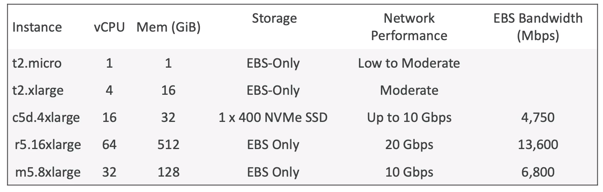
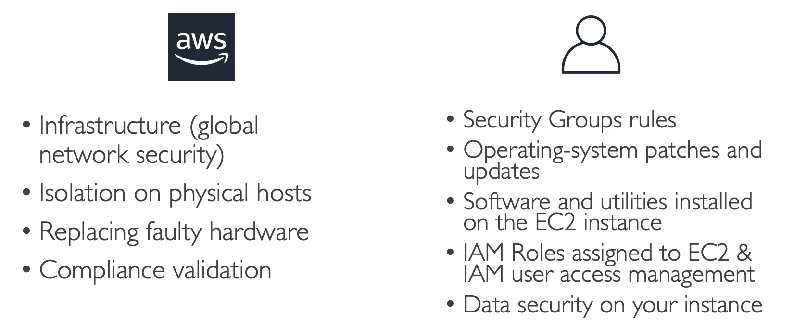

# Section 5 - Elastic Compute Cloud
### AWS Budget
1. Choose Budget Type
2. Set up your Budget
3. Configure Alerts
4. Attach actions
To test I have set an budget of $8.00

## Elastic Compute Cloud - EC2 (fundamental to most the services)
We can rent virtual machines(EC2), Store data on drives(EBS), distribute load(ELB), Scale the services(ASG)

### EC2 Configuration
- Operating System
- CPU (power and cores)
- RAM
- Storage Space - Network Attached(EBS, EFS) or Hardware(EC2 Instance Store)
- Network Card
- Firewall Rules
- Bootstrap Script - to configure EC2 called **EC2 User Data**

Let's see more about EC2 User Data
### EC2 User Data
It is a bootstrap script which allows us to lauch commands when the machine starts. But the scipt will run only once when the instance first start.
This can automate tasks such as installing softwares, updates and any automation
**The script only runs with the root user(sudo - super user)**

### EC2 Instance Types - Example

Here, we are using t2.micro as it as 750 hours free tier per month
#### Overview: Say m5.2xlarge
m - instance class
5 - generation
2xlarge - size of the instance class
#### Types
- General Purpose Instance -web servers and code repos
- Compute Optimized - compute intensive, batch processing, machine learning etc
- Memory Optimized - large datasets in memory, databases, in-memory operations, real time processing
- Storage Optimized - storage intensive, high speed read and write, data warehousing, distributed file systems
* * *
### Security Groups (contains allowed rules/Firewall on EC2 instances)
They control how the traffic is allowed in and out of EC2 instance. They have rules referenced by IP address or by other security group
***Note:** Security groups can reference each other*

#### Things regulated by Security Groups
- Access to ports
- Authorized IP ranges
- Inbound network (other to instance)
- Outbound network (instance to other)

### Important things to know
- Same Security Group can be attached to multiple instances. Also an instance can have multiple security groups too
- For region/VPC combination the security group will vary
- It's good to maintain one separate security group for SSH access
- By default, all inbound traffic is **blocked**; all outbound trafiic is **authorised**

*Time out error(application not accessible) --> Security group issue
Connection refused error --> Application error*

### Port numbers to remember`(Very Important)`
• 22 = SSH (Secure Shell) - log into a Linux instance
• 21 = FTP (File Transfer Protocol) - upload files into a file share
• 22 = SFTP (Secure File Transfer Protocol) - upload files using SSH
• 80 = HTTP - access unsecured websites
• 443 = HTTPS - access secured websites
• 3389 = RDP (Remote Desktop Protocol) - log into a Windows instance

### SSH from Linux/Mac
###### EC2.pem file is the certificate we downloaded when creating our instance
13.57.189.26 - Our public IP
```
chmod 0400 EC2.pem 
ssh -i EC2.pem ec2-user@13.57.189.26
```

We can add IAM roles in our security tabs and access everthing within the instance
* * *
### EC2 Instance Purchase Options
-- Need to be filled --

## Shared Responsibility Model of EC2

