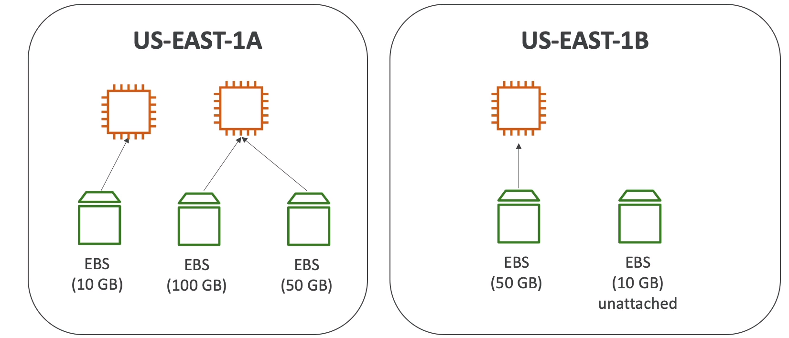
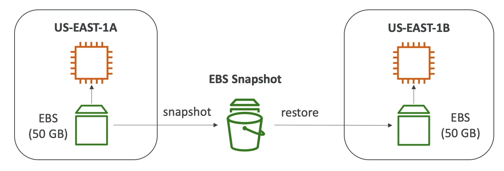
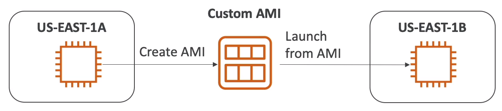
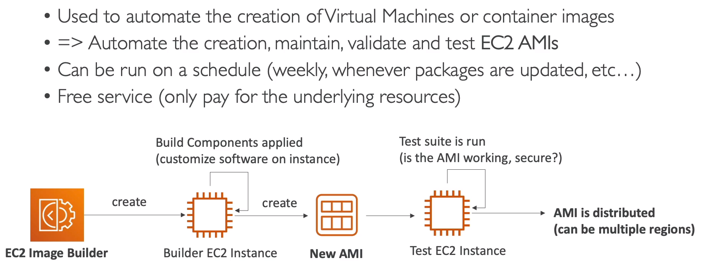

# Section 6 - EC2 Instance Storage
## Elastic Block Storage - EBS
It is a network drive(uses network to transfer data - there will be a latency) which we can attach to the instance. It also allows to persist our data even after the termination of the instance. In this way, we can mount the same EBS with other instance and use it again
**Note:** EBS can be mounted to only one instance at a time(at CCP level). It is bound to specific availability zones(EBS from zone-1a cannot be attached to zone-1b). We can take snapshot to move volumes

Here, we attached two EBS to same instance. But, a single EBS cannot be attached to two instance simultaneously(at this CCP level)
**Instance and EBS should be in the same zone**
* * *
### Delete on Termination
By default, the root EBS volume will be enabled for deletion and other EBS volume will be disabled
**Use Case:** If we want to preserve the root volume disable the deletion during the creation of the instance or take snapshot(backup)

### EBS Snapshot
We can take a backup of the EBS volume anytime without even detaching it from the instance. But it is a good practice to stop or detach the instance from the EBS volume before the snapshot

*fig 6.2 - EBS snapshot helps to transfer data across zones and regions*

#### Snapshot Features
- **EBS Snapshot Archive**
We can move the snapshot to archive tier(75% cheaper) but it requires 24 to 72 hours to restore the archive
- **Snapshot Recycle Bin**
We can set rules to retain snapshots that are accidententally deleted and can retain from 1 day to 1 year

Zone to other region --> Take snapshot > copy snapshot to zones in other regions > create a volume from it
Zone to other zone --> Take a snapshot > create a volume from it in essential zone

### Recycle Bin - Retention Policy
AWS has a recycle bin which stores accidentially deleted EBS volume and Amazon Machine Image(AMI). Create a retention policy which retain our EBS volume or AMI for a specific period of time
* * *
## AMI - Amazon Machine Image
It is a **customization** of the EC2 instance. Which means you can add your own OS, software, configurations that allows faster booting and configuration time. It is built for **specific regions** but can be moved to other regions.
**Launching EC2 instance**:
1. Public AMI
2. Our own AMI
3. AWS Marketplace AMI

**Process:** Start a EC2 instance --> customize it --> stop the instance(for data integrity) --> build an AMI(creates a snapshot in the backgroud) --> Launch instance from other AMI

*fig - 6.3 Create AMI by customizing it from instance of zone-a to launch it in zone-b*
* * *
## EC2 image Builder

